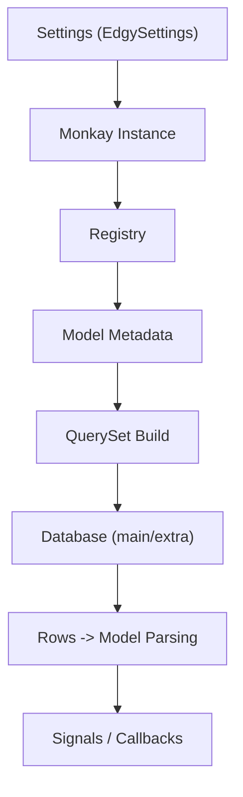
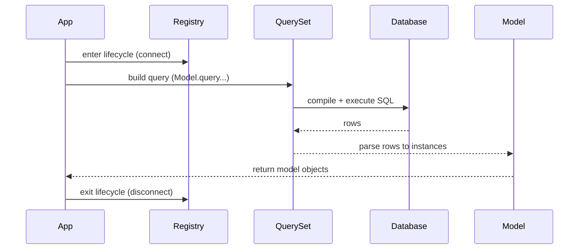

# Architecture Overview

Edgy is intentionally small at the API surface but rich in internals. This page explains the moving parts, why they exist, and how they interact at runtime.

## What Is the Runtime Architecture?

At runtime, Edgy is mostly these components:

* **Settings** (`EdgySettings`): Controls migrations, storage, shell, and runtime behavior.
* **Monkay instance** (`edgy.monkay.instance`): The active application context (`registry`, optional `app`, storages).
* **Registry**: The command center for models, database connections, metadata, and schema operations.
* **Models and QuerySets**: Declarative models and immutable query pipelines.
* **Signals and callbacks**: Lifecycle hooks for save/update/delete/migrate paths.

If you already use Edgy comfortably, this page is mainly for when you need to reason about lifecycle, advanced integrations, or debugging.

## Runtime Map



The diagram is the high-level flow. For setup details, read [Connection Management](../connection.md). For schema/database switching, read [Queries](../queries/queries.md#selecting-the-database-and-schema).

## Why It Is Structured This Way

The design optimizes for:

* **Framework agnosticism**: Edgy works with ASGI apps and non-ASGI/sync contexts.
* **Predictable lifecycle**: Databases are connected/disconnected through explicit registry scopes.
* **Composable behavior**: Signals, callbacks, and settings let you customize without rewriting core logic.
* **Safe multi-tenancy/multi-db**: Schema and connection switching is first-class in QuerySet and Registry.

## When You Need to Know This

You usually need architectural context when:

* integrating Edgy in a custom framework setup,
* running Edgy from sync code (`run_sync` + `with_async_env`),
* using multiple registries/databases/schemas,
* debugging lifecycle warnings such as `DatabaseNotConnectedWarning`,
* extending model registration behavior with callbacks.

## How The Pieces Fit

### 1. Startup and Ambient Context

You initialize a `Registry`, create/wrap your app, then set `edgy.monkay.instance`.

```python
{!> ../docs_src/connections/asgi.py !}
```

### 2. Connection Lifecycle

The registry is the lifecycle boundary:

* `async with registry:` in async-native code.
* `with registry.with_async_env():` in sync code.

```python
{!> ../docs_src/connections/contextmanager.py !}
```

### 3. Query Execution

`Model.query` creates a QuerySet. QuerySet methods clone state and compile to SQL only on execution (`await`, `.get()`, `.all()`, etc.).

### 4. Result Parsing

Rows are parsed back into model instances, including relationship handling (`select_related`, `prefetch_related`) and schema/db context.

## Query/Request Lifecycle (High Level)

1. App enters lifecycle scope (`registry` connected).
2. QuerySet is built from model manager (`Model.query...`).
3. QuerySet compiles SQL from model metadata + active schema/db.
4. Query is executed through the selected `Database`.
5. Result rows are parsed into model instances.
6. Hooks/signals run where applicable (save/update/delete/migrate).
7. Lifecycle exits and registry disconnects databases.

### Query Lifecycle Diagram



## Extension Points

Common extension points:

* **Settings**: preloads, extensions, migration behavior, storage, concurrency limits.
* **Signals**: pre/post save, update, delete, migrate.
* **Registry callbacks**: mutate or enrich models when registered.
* **Model-level hooks**: custom save/delete behavior and admin marshall customization.

## Practical Advice

* Keep a long-lived registry scope in servers/workers.
* Avoid opening/closing DB contexts around every single operation.
* Use `using(database=..., schema=...)` explicitly in multi-db/multi-schema code paths.
* Prefer context-managed schema/tenant switching (`with_schema`, `with_tenant`).

## See Also

* [Request and Query Lifecycle](./request-lifecycle.md)
* [Component Interactions](./component-interactions.md)
* [Connection Management](../connection.md)
* [Registry](../registry.md)
* [Queries](../queries/queries.md)
* [Settings](../settings.md)
* [Troubleshooting](../troubleshooting.md)
