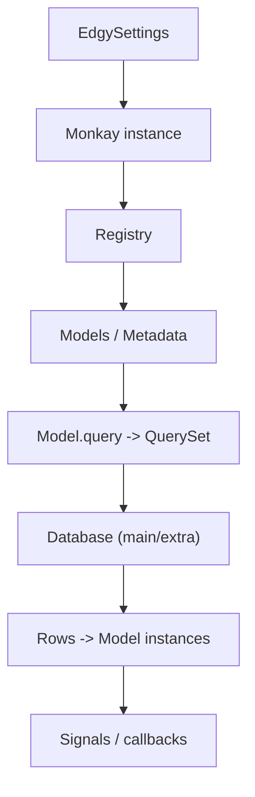

# Component Interactions

Edgy keeps a relatively small API surface, but internally multiple components collaborate closely.

This page maps those interactions so you can reason about runtime behavior and extension points.

## What

The core runtime components are:

* `EdgySettings`
* `edgy.monkay.instance`
* `Registry`
* `Model` / `QuerySet`
* `Database` objects (default + optional `extra`)
* signals and model callbacks

## Why

This map helps when:

* wiring custom startup flows,
* introducing extensions/preloads,
* debugging model registration, schema operations, or query behavior.

## How

### Settings to instance

Settings are loaded through `EDGY_SETTINGS_MODULE` (or defaults), then used by Monkay for preloads/extensions.

See [Settings](../settings.md).

### Instance to registry

The active instance provides the runtime registry and optional app/storages.

See [Connection Management](../connection.md).

### Registry to models

Models register against a registry and contribute SQLAlchemy metadata, including schema behaviors and registry callbacks.

See [Models](../models.md) and [Registry](../registry.md).

### Models to QuerySet

Model managers create QuerySets, QuerySets compile/execute SQL, and results become model instances.

See [Queries](../queries/queries.md).

### Result hooks

Signals and related hooks run on write paths (save/update/delete/migrate).

See [Signals](../signals.md).

## Example

If you are adding a custom extension:

1. define extension + preload settings in your custom `EdgySettings`,
2. ensure the app/instance path is preloadable for CLI/runtime commands,
3. validate query lifecycle using `edgy shell` and migration commands.

See [CLI Commands](../cli/commands.md) and [Migrations](../migrations/migrations.md).

## See Also

* [Getting Started](../getting-started/index.md)
* [How-To Guides](../guides/index.md)
* [Settings](../settings.md)
* [Architecture Overview](./architecture.md)
