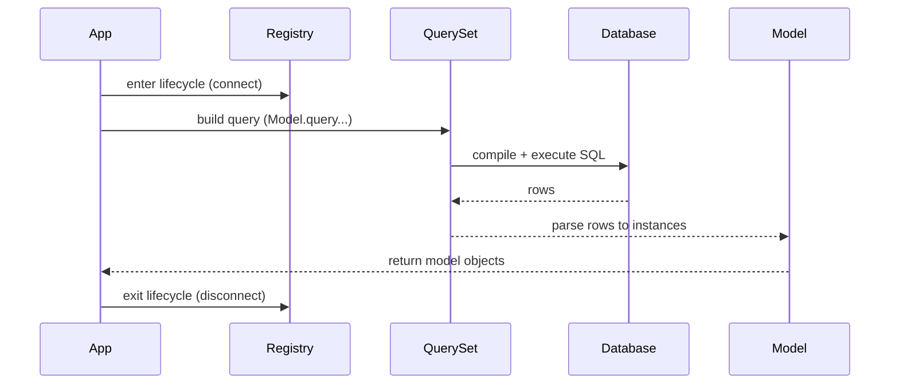

# Request and Query Lifecycle

This page explains the normal lifecycle of an Edgy-backed request/query execution path.

If you are troubleshooting lifecycle issues, read this together with [Connection Management](../connection.md) and [Troubleshooting](../troubleshooting.md).

## What

The lifecycle is the path from:

1. starting the application lifecycle,
2. executing queries,
3. parsing model instances,
4. closing registry/database scopes cleanly.

## Why

Understanding this flow helps you avoid:

* repeated connection setup overhead,
* `DatabaseNotConnectedWarning`,
* schema/database context mistakes in multi-tenant and multi-db setups.

## When

You usually need this model when:

* integrating with ASGI lifecycle hooks,
* running queries from sync code with `run_sync`,
* debugging query behavior across schemas/databases.

## How

### ASGI lifecycle path

In ASGI-native applications, the registry lifecycle is attached to the app lifecycle.

```python
{!> ../docs_src/connections/asgi.py !}
```

### Query execution path

During request handling:

1. `Model.query` builds a QuerySet.
2. QuerySet methods clone/compose the query state.
3. Execution happens on await (`all`, `get`, `create`, etc.).
4. Rows are parsed back into model instances.
5. Related loading and signal hooks run where applicable.



### Sync lifecycle path

In sync-first code, wrap execution with `with_async_env` and call `run_sync` inside that scope.

```python
{!> ../docs_src/connections/contextmanager.py !}
```

## Example

For database/schema-aware querying, use:

* `Model.query.using(database=..., schema=...)`
* `with_schema(...)` / `set_schema(...)` scoped helpers

See [Queries](../queries/queries.md#selecting-the-database-and-schema).

## See Also

* [Getting Started](../getting-started/index.md)
* [Tutorials](../tutorials/index.md)
* [Connection Management](../connection.md)
* [Registry](../registry.md)
