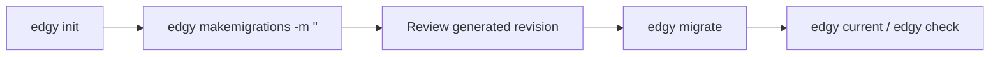

# First Migration Cycle

Once your first model works, the next milestone is a repeatable migration workflow.

This page shows the default path used in most Edgy projects.

## Prerequisite

Make sure Edgy can resolve your app instance.

Use one of:

* `--app path.to.module`
* `EDGY_DEFAULT_APP=path.to.module`
* `preloads` in custom settings

See [Application Discovery](../migrations/discovery.md) for details.

## Standard Cycle



## Step-by-Step

### 1. Initialize migration repository

```shell
$ edgy init
```

### 2. Generate migrations from model changes

```shell
$ edgy makemigrations -m "Initial schema"
```

### 3. Apply migrations

```shell
$ edgy migrate
```

### 4. Validate migration state

```shell
$ edgy current
$ edgy check
```

## Why This Order Matters

* `init` creates the migration environment once.
* `makemigrations` captures model deltas explicitly.
* `migrate` applies those deltas to the target database.
* `current` and `check` prevent drift between code and schema.

## Troubleshooting

If auto-discovery fails, start commands with:

```shell
$ edgy --app myproject.main migrate
```

If multiple heads appear:

```shell
$ edgy heads
$ edgy merge -m "Merge heads" <rev_a> <rev_b>
```

## See Also

* [CLI Commands](../cli/commands.md)
* [Migrations](../migrations/migrations.md)
* [Application Discovery](../migrations/discovery.md)
* [Troubleshooting](../troubleshooting.md)
