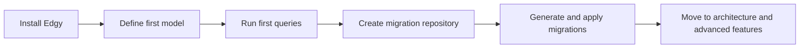

# Getting Started

Welcome to the guided learning path for Edgy.

If this is your first contact with the ORM, this section gives you the shortest route from installation to production-ready migration workflows.

## Learning Path

## Start Here

1. [Install and run your first query](./install-and-first-query.md)
2. [Run your first migration cycle](./first-migration-cycle.md)
3. [Read the architecture mental model](../concepts/architecture.md)
4. [Continue with focused tutorials](../tutorials/index.md)

## What You Will Learn

* how to define and query models,
* how to keep application discovery predictable,
* how to establish a safe migration workflow,
* how to navigate deeper concepts and references.

## See Also

* [Edgy Overview](../index.md)
* [Connection Management](../connection.md)
* [Models](../models.md)
* [Queries](../queries/queries.md)
* [CLI Commands](../cli/commands.md)
