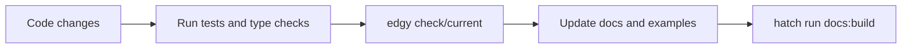

# Developer Workflow: Local Dev, Test, Debug

This guide summarizes a practical day-to-day workflow for Edgy projects.

## 1. Run Docs While Building Features

```shell
$ hatch run docs:serve
```

This serves docs with live reload and keeps generated markdown up to date from `docs` + `docs_src`.

## 2. Run Tests

```shell
$ task test
```

For a specific test target:

```shell
$ hatch run test:test tests/path/to/test_file.py -q
```

## 3. Verify Types and Lint

```shell
$ task lint
$ task mypy
```

## 4. Validate Migration State

```shell
$ edgy check
$ edgy current
```

## 5. Debug Common Runtime Issues Quickly

If you see lifecycle warnings:

* verify registry/database scope in code (`async with registry:` or `with registry.with_async_env():`),
* confirm app discovery settings (`--app`, `EDGY_DEFAULT_APP`, or preload setup).

## Workflow Map



## See Also

* [Testing](../testing/index.md)
* [Debugging](../debugging.md)
* [Troubleshooting](../troubleshooting.md)
* [Contributing](../contributing.md)
