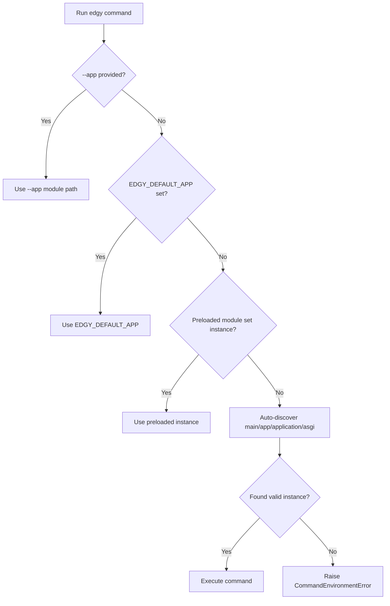

# Application Discovery

Edgy provides multiple ways to identify and run commands. The two primary methods are:

- [Environment variables](#environment-variables)
- [Auto-discovery](#auto-discovery)

If you want a command-by-command map first, check [CLI Commands](../cli/commands.md).

## Auto-Discovery

If you're familiar with frameworks like Django, you might know how `manage.py` serves as a command-line interface for running internal commands. While Edgy doesn't work exactly the same way, it does attempt to automatically detect the appropriate application and will raise an error if none is found or if neither an [environment variable](#environment-variables) nor `--app` is provided.

**Auto-discovery serves as an alternative to manually specifying `--app` or setting the `EDGY_DEFAULT_APP` environment variable.**

### How Does It Work?

If **you do not provide `--app` or set `EDGY_DEFAULT_APP`**, Edgy will attempt to locate your application automatically.

For example, consider the following project structure:

```shell
title="myproject"
.
├── Makefile
└── myproject
    ├── __init__.py
    ├── apps
    │   ├── __init__.py
    ├── configs
    │   ├── __init__.py
    │   ├── development
    │   │   ├── __init__.py
    │   │   └── settings.py
    │   ├── settings.py
    │   └── testing
    │       ├── __init__.py
    │       └── settings.py
    ├── main.py
    ├── tests
    │   ├── __init__.py
    │   └── test_app.py
    └── urls.py
```

!!! Tip
    The application can be built using Ravyn, Starlette, Sanic, FastAPI, or other frameworks.

Edgy follows these steps to locate the application:

1. If no `--app` or `EDGY_DEFAULT_APP` is specified, it searches the current directory for a file named:
   - `main.py`
   - `app.py`
   - `application.py`
   - `asgi.py`

   *(If these files are importable without the `.py` extension, they will also be considered.)*

2. If none of these files are found, Edgy checks the first-level subdirectories and repeats the search.
3. If still not found, it raises a `CommandEnvironmentError` exception.
4. Once a matching file is located, Edgy verifies whether the instance is correctly set.

### Discovery Resolution Order



## Environment Variables

Edgy uses environment variables to determine the correct database when generating migrations:

- **`EDGY_DATABASE_URL`** - Specifies the database connection URL.
- **`EDGY_DATABASE`** - Specifies an additional database name.

By default, the primary database is used. Since Edgy is framework-agnostic, this approach ensures seamless migration handling across different environments, including production.

## Using Auto-Discovery in Practice

Now that we've seen how Edgy discovers applications, let's look at how it works with actual commands. The following structure will be used as a reference:

```shell
title="myproject"
.
├── Makefile
└── src
    ├── __init__.py
    ├── apps
    │   ├── accounts
    │   │   ├── directives
    │   │   │   ├── __init__.py
    │   │   │   └── operations
    │   │   │       └── __init__.py
    ├── configs
    │   ├── __init__.py
    │   ├── development
    │   │   ├── __init__.py
    │   │   └── settings.py
    │   ├── settings.py
    │   └── testing
    │       ├── __init__.py
    │       └── settings.py
    ├── main.py
    ├── tests
    │   ├── __init__.py
    │   └── test_app.py
    └── urls.py
```

The `main.py` file contains the Edgy migration setup.

```python title="myproject/src/main.py"
{!> ../docs_src/commands/discover.py !}
```

This basic example includes two endpoints, but you can structure your application as needed.

### Running Commands

Edgy supports both auto-discovery and manual application specification for executing commands like:

- **`init`** - Initializes migrations and creates the migrations folder.
- **`makemigrations`** - Generates migrations for the application.

#### Using Auto-Discovery

```shell
$ edgy init
```

Since no `--app` or `EDGY_DEFAULT_APP` is provided, Edgy automatically discovers the application in `src/main.py` following its search pattern.

#### Using Preloads

Edgy supports automatic registration via preloads. Instead of explicitly providing `--app` or `EDGY_DEFAULT_APP`, you can use the `preloads` setting in your configuration to specify an import path. When an instance is set in a preloaded file, auto-discovery is skipped.

See [Settings](../settings.md) for preload configuration details.

#### Using `--app` or `EDGY_DEFAULT_APP`

##### `--app`

```shell
$ edgy --app src.main init
```

##### `EDGY_DEFAULT_APP`

Set the environment variable:

```shell
$ export EDGY_DEFAULT_APP=src.main
```

Then run:

```shell
$ edgy init
```

### Running `makemigrations`

For more details, see [Migrations](./migrations.md#migrate-your-database).

#### Using Auto-Discovery

```shell
$ edgy makemigrations
```

Again, Edgy automatically finds the application.

#### Using `--app` or `EDGY_DEFAULT_APP`

!!! Note
    As of version 0.23.0, the import path must point to a module where the `Instance` object triggers automatic registration. See [Connection](../connection.md).

##### `--app`

```shell
$ edgy --app src.main makemigrations
```

##### `EDGY_DEFAULT_APP`

Set the environment variable:

```shell
$ export EDGY_DEFAULT_APP=src.main
```

Then run:

```shell
$ edgy makemigrations
```

## See Also

* [CLI Commands](../cli/commands.md)
* [Settings](../settings.md)
* [Connection Management](../connection.md)
* [Getting Started: First Migration Cycle](../getting-started/first-migration-cycle.md)
