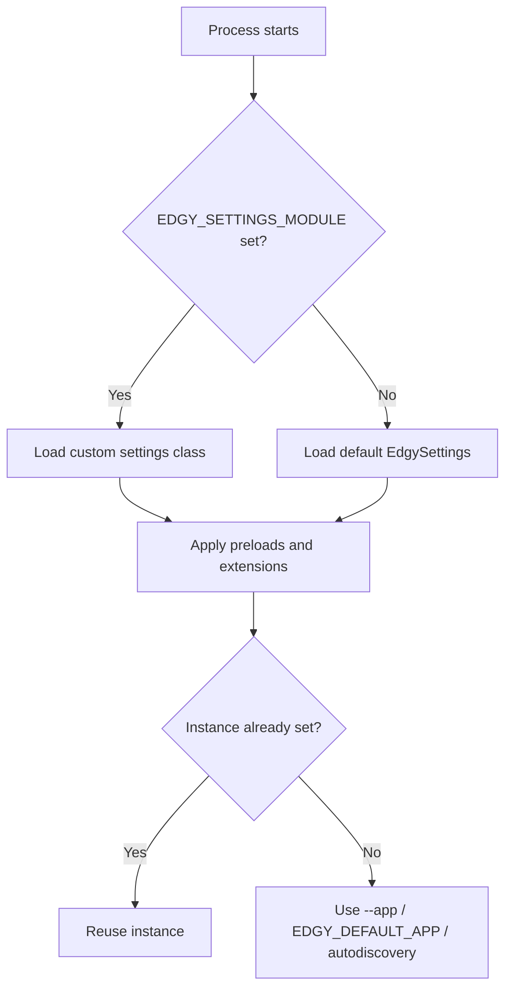

# Settings in Edgy

Have you ever wished you could centrally control migrations, media files, shell behavior, and runtime tuning? Edgy was built with that in mind.

Settings are plain **[Pydantic BaseSettings](https://pypi.org/project/pydantic-settings/)** classes, so they are typed, extensible, and easy to override.

## Edgy Settings Module

Edgy uses one environment variable to locate its settings class:

* **EDGY_SETTINGS_MODULE**

### EDGY_SETTINGS_MODULE

Edgy reads `EDGY_SETTINGS_MODULE` in the format:

`path.to.module.SettingsClass`

If it is not set, Edgy uses the internal default `EdgySettings`.

#### Custom Settings

To create your own settings, inherit from `EdgySettings` (or `TenancySettings` for tenancy-focused projects) and override only what you need.

```python title="myproject/configs/settings.py"
{!> ../docs_src/settings/custom_settings.py !}
```

### Practical Preload Example

If your app instance is set in `myproject.main`, you can preload it once and run commands without passing `--app` every time.

```python title="myproject/configs/settings.py"
from edgy.conf import EdgySettings


class MyCustomSettings(EdgySettings):
    preloads = ("myproject.main",)
```

Then run:

```shell
$ EDGY_SETTINGS_MODULE=myproject.configs.settings.MyCustomSettings edgy shell
$ EDGY_SETTINGS_MODULE=myproject.configs.settings.MyCustomSettings edgy makemigrations
```

For discovery behavior details, see [Application Discovery](./migrations/discovery.md).

### Runtime Resolution Map



!!! Danger
    Exercise caution when overriding settings, as it may break functionality.

## What You Can Configure

### Core Runtime

* **preloads**: Modules loaded early. Supports `module` and `module:callable`.

    <sup>Default: `()`</sup>

* **extensions**: Monkay extensions loaded by Edgy.

    <sup>Default: `()`</sup>

* **allow_auto_compute_server_defaults**: Enables implicit server-default handling for supported fields.

    <sup>Default: `True`</sup>

### Migration Settings

* **allow_automigrations**: Allow automatic migration execution during registry startup when configured.

    <sup>Default: `True`</sup>

* **multi_schema**: Multi-schema migration mode (`False`, `True`, or regex/pattern string).

    <sup>Default: `False`</sup>

* **ignore_schema_pattern**: Pattern for ignored schemas during multi-schema operations.

    <sup>Default: `"information_schema"`</sup>

* **migrate_databases**: Databases included in migrations (`None` means default/main DB).

    <sup>Default: `(None,)`</sup>

* **migration_directory**: Path to your migration directory.

    <sup>Default: `"migrations/"`</sup>

* **alembic_ctx_kwargs**: Extra kwargs forwarded to Alembic context.

    <sup>Default: `{"compare_type": True, "render_as_batch": True}`</sup>

### Media & Storage Settings

* **file_upload_temp_dir**: Optional temporary upload directory.

    <sup>Default: `None`</sup>

* **file_upload_permissions**: Default file mode for uploaded files.

    <sup>Default: `0o644`</sup>

* **file_upload_directory_permissions**: Default directory mode for upload folders.

    <sup>Default: `None`</sup>

* **media_root**: Filesystem location where media is stored.

    <sup>Default: `"media/"`</sup>

* **media_url**: URL prefix used by storages for generated file URLs.

    <sup>Default: `""`</sup>

* **storages**: Storage backend mapping. The `default` storage is used by file/image fields unless overridden.

    <sup>Default backend: `edgy.core.files.storage.filesystem.FileSystemStorage`</sup>

### ORM Concurrency Settings

* **orm_concurrency_enabled**: Global switch for internal ORM concurrency limits.

    <sup>Default: `True`</sup>

* **orm_concurrency_limit**: Max concurrency for high-level fan-out operations (prefetch/lazy relation loading).

    <sup>Default: `10`</sup>

* **orm_row_prefetch_limit**: Concurrency limit for row-level prefetch workloads.

    <sup>Default: `5`</sup>

* **orm_clauses_concurrency_limit**: Concurrency limit for dynamic clause evaluation.

    <sup>Default: `20`</sup>

* **orm_registry_ops_limit**: Concurrency limit for registry-level operations.

    <sup>Default: `10`</sup>

### Shell Settings

* **ipython_args**: Arguments passed to IPython in `edgy shell`.

    <sup>Default: derived from `IPYTHON_ARGUMENTS`, fallback `"--no-banner"`</sup>

* **ptpython_config_file**: Configuration file for `edgy shell --kernel ptpython`.

    <sup>Default: `"~/.config/ptpython/config.py"`</sup>

### Admin Settings

* **admin_config**: Lazy-loaded `AdminConfig` object with admin-related options such as:
  `admin_prefix_url`, `admin_extra_templates`, `title`, `menu_title`, `dashboard_title`, `favicon`, `sidebar_bg_colour`, `SECRET_KEY`.

For details see [Admin](./admin/admin.md).

### Tenancy Settings

If you inherit from `TenancySettings`, you also get tenancy-specific settings like:

* `auto_create_schema`
* `auto_drop_schema`
* `tenant_schema_default`
* `tenant_model`
* `domain`
* `domain_name`
* `auth_user_model`

For details see [Contrib Tenancy](./tenancy/contrib.md).

## How to Use It

Using the example above (`myproject.configs.settings.MyCustomSettings`):

```shell
$ EDGY_SETTINGS_MODULE=myproject.configs.settings.MyCustomSettings edgy <COMMAND>
```

Optional prerequisite: set one of the preload imports to the application path. This way you can skip providing the `--app` parameter or `EDGY_DEFAULT_APP`.

### Practical Calls

**Starting the default shell:**

```shell
$ EDGY_SETTINGS_MODULE=myproject.configs.settings.MyCustomSettings edgy shell
```

**Starting PTPython shell:**

```shell
$ EDGY_SETTINGS_MODULE=myproject.configs.settings.MyCustomSettings edgy shell --kernel ptpython
```

**Creating the migrations folder:**

```shell
$ EDGY_SETTINGS_MODULE=myproject.configs.settings.MyCustomSettings edgy init
```

**Generating migrations:**

```shell
$ EDGY_SETTINGS_MODULE=myproject.configs.settings.MyCustomSettings edgy makemigrations
```

**Applying migrations:**

```shell
$ EDGY_SETTINGS_MODULE=myproject.configs.settings.MyCustomSettings edgy migrate
```

## See Also

* [Architecture Overview](./concepts/architecture.md)
* [Connection Management](./connection.md)
* [Migrations](./migrations/migrations.md)
* [Shell Support](./shell.md)
* [Troubleshooting](./troubleshooting.md)
