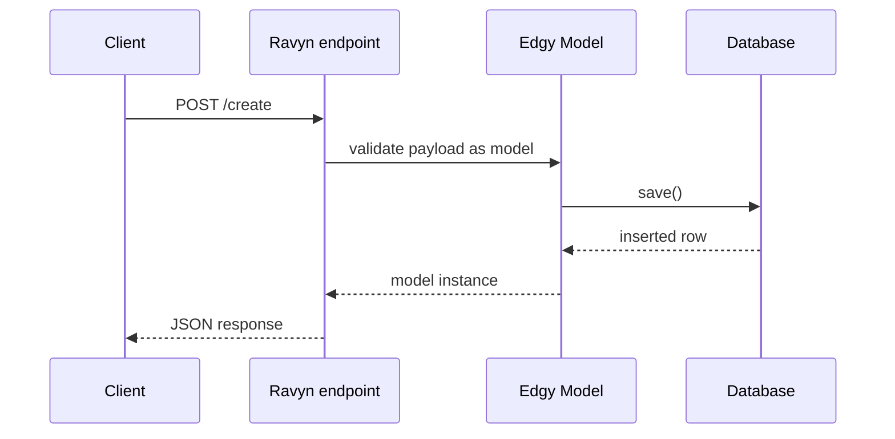

# Build a Ravyn API with Edgy

This tutorial shows a practical API path:

1. define a model,
2. persist incoming request data,
3. wire Edgy lifecycle into an ASGI app.

## Why This Tutorial

It demonstrates a real request path with a framework integration, not only isolated query snippets.

## Application Flow



## Implementation

```python
{!> ../docs_src/quickstart/ravyn.py !}
```

## What to Observe

* The payload is validated through the model fields.
* The handler persists data with `await data.save()`.
* `models.asgi(...)` binds the app lifecycle to Edgy.

## Try It

Send a request to `/create` with a payload compatible with `User`.

Expected response shape:

```json
{
  "id": 1,
  "name": "Edgy",
  "email": "edgy@ravyn.dev",
  "language": "EN",
  "description": "A description"
}
```

## Next Step

Move to [Multi-Database and Schema Workflow](./multi-db-and-schema-workflow.md) when you need cross-db or tenant-aware behavior.

## See Also

* [Connection Management](../connection.md)
* [Models](../models.md)
* [Queries](../queries/queries.md)
* [Tenancy (Edgy)](../tenancy/edgy.md)
