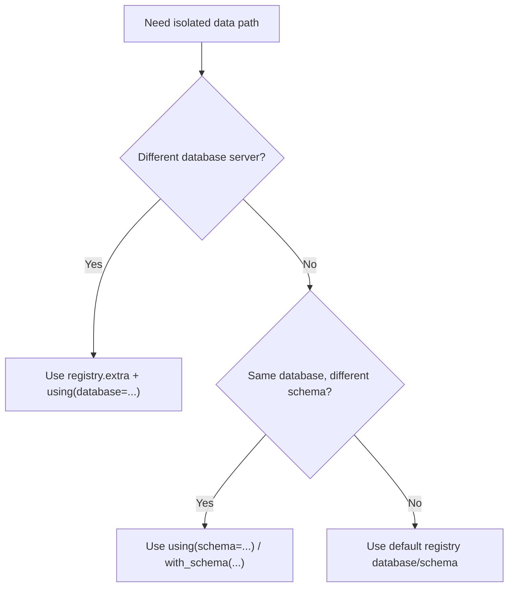

# Multi-Database and Schema Workflow

Use this tutorial when your application needs:

* multiple databases (`registry.extra`), or
* per-tenant/per-schema query context.

## Choosing the Right Path



## Step 1: Declare Multiple Databases

```python
{!> ../docs_src/registry/extra/declaration.py !}
```

## Step 2: Write Data to an Extra Database

```python
{!> ../docs_src/registry/extra/create.py !}
```

## Step 3: Use Schema Context for Tenant-Like Routing

For schema-scoped operations:

```python
from edgy.core.db import with_schema

with with_schema("tenant_a"):
    users = await User.query.all()
```

Or explicitly per query:

```python
users = await User.query.using(schema="tenant_a").all()
```

## Operational Notes

* Keep registry lifecycle open (`async with registry:`) while serving requests.
* Ensure target schemas exist before querying them.
* Keep database names in `using(database=...)` aligned with `registry.extra` keys.

## See Also

* [Registry](../registry.md)
* [Queries: selecting database and schema](../queries/queries.md#selecting-the-database-and-schema)
* [Tenancy (Edgy)](../tenancy/edgy.md)
* [Connection Management](../connection.md)
